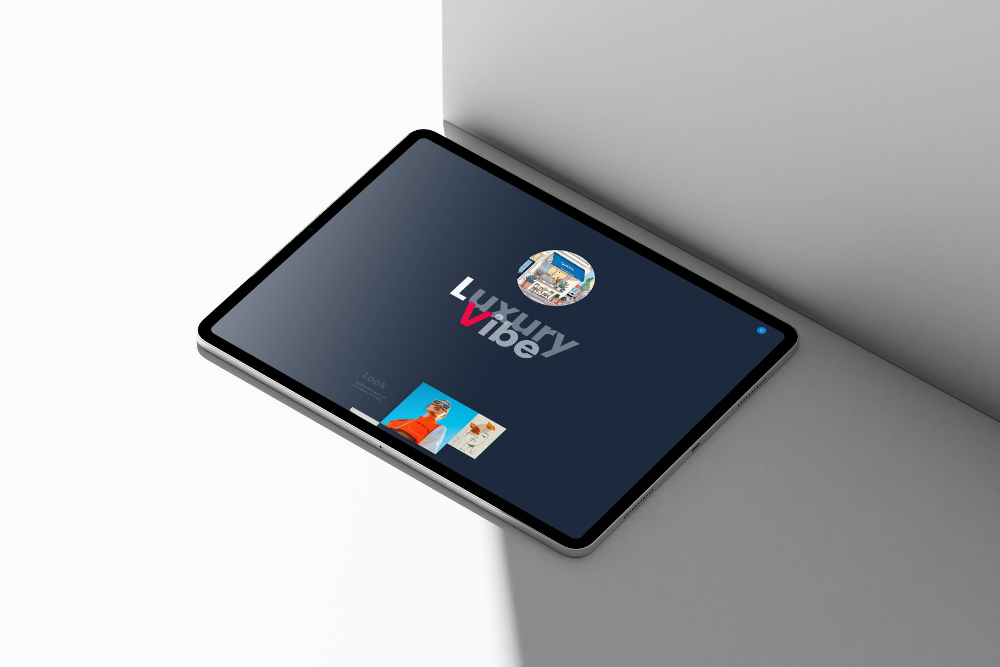

       

### [Junso](https://junso.vercel.app/) is a landing for premium brands & boutiques.

Responsive layout    
Brand showcase table  
Light/Dark theme toggle   
Vanilla JS
ScrollReveal.js
Yandex Maps API    


The layout focuses on visual storytelling, smooth animations, and a refined user experience inspired by luxury fashion aesthetics. It includes brand showcases, store listings, contact information, interactive navigation, and a map integration.

Perfect for:   

- Luxury boutiques   
- Fashion brands   
- Corporate portfolios   
- Premium shopping centers   
- High-end product showcases   

✨ Features   

🎨 Modern Luxury Design   

Clean typography (Google Fonts – Poppins)   

- Minimal and elegant UI   
- Dark/Light theme toggle   

📱 Fully Responsive Layout   

- Optimized for desktop, tablet, and mobile   
- Grid-based adaptive sections   

🧭 Interactive Navigation   

- Animated side navigation menu   
- Smooth open/close transitions   

🖼 Visual Portfolio Section   

- Image-based showcase layout   
- 3D reveal effects   
- Scroll-based animations (ScrollReveal)   

🏬 Luxury Brand Directory   

- Organized brand table with external links   
- Clean and structured presentation   

🗺 Map Integration   

- Integrated Yandex Maps   
- Clickable location link   

📩 Contact Section   

- Email contact   
- Social media links   
- Footer with branding elements   

⚡ Performance Enhancements   

- Loading screen animation   
- Optimized assets (WebP images)   
- Lightweight structure   

🌙 Theme Switcher   

- Toggle between day/night mode   

##### Tech Stack   
```
Bun | Vite | Vercel | Tailwind | Vanilla JS   
```